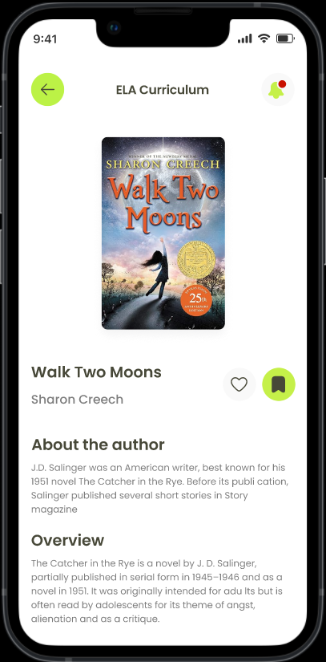

# 📱 Functional Testing – scott_meaders (Secure Curriculum Delivery Mobile App)

**SQA Engineer:** Md Abdur Rahaman Tutul  

---

## 📌 Project Overview
This repository contains the **manual functional testing report** for a mobile application designed to securely deliver curriculum content to school districts.  

The app hosts **novel-based units** including lessons, PowerPoints, and videos, ensuring **secure access** for authorized users only.

---

## 🏫 Client Requirements

### 🎯 Role Management
- **Super Admin** (You)
- **School Admin** (District-level Access)
- **Teachers** (Content Consumers)
- **Students** (End Users)

### 📂 Core Features
- Secure login and **single login per school**  
- **View-only access** for content  
- Video integration  
- Admin panel for content & access management  
- Add new novel units without coding  
- In-app content management system  
- Payment gateway (invoice-based)  
- Access revoke/grant options per school  
- Mobile-friendly design  
- Support for future updates & scalability  
- High-level security to prevent unauthorized downloads  

---

## 🛠 My Deliverables (QA Scope)
- Performed **manual functional testing** against client requirements.  
- Compared app functionality with Figma designs & provided feedback.  
- Logged issues in **Google Sheets** bug report.  
- Collaborated with the development team to fix issues.  
- Retested after fixes to ensure stability.  

---

## 📊 Bug Report & Design References
- 📄 **Bug Report (Google Sheet):** [View Report](https://docs.google.com/spreadsheets/d/1ovpwm7ZRdg2rUhDwF6Qaei5e3hdDaR7kknwayQOOp-I/edit?usp=sharing)  
- 🎨 **Figma Design:** [View Design](https://www.figma.com/design/4rJN8enXZV1rurtFDzsYL5/scott_meaders---WpDesign7-----FO4276B5956C8?node-id=1-6&p=f&t=ly0oRgMaFeIFCivc-0)  
- 📱 **APK File:** *(Attach `app-release.apk` in the repository)*[view](https://github.com/abdurtutul/scott_meaders-functional-testing/blob/main/app-release.apk)  

---

## 📸 App Screenshots

  
  
  
  
  
  
  

---

## 📂 App Modules Tested

### **Authentication Screens**
- Login
- Signup
- Forget Password
- OTP Verification
- User Information Input  

### **Home Screen**
- **ELA Curriculum**
- **Training Resources (PD)**
- **Introduction to Expository Essays**

### **ELA Curriculum**
- Grades (6th, 7th, ..., Supplemental Novels)
- Course Syllabus
- Novel Units
- Bell Ringers
- Standard-Based Lessons
- Grammar Lessons

---

## ✅ Testing Process
1. Verified each functionality against **client requirements**.
2. Checked UI against **Figma design** for accuracy.
3. Logged functional issues in Google Sheets bug tracker.
4. Collaborated with developers to resolve bugs.
5. Conducted **retesting** to confirm fixes.

---

## 👨‍💻 SQA Engineer
**Md Abdur Rahaman Tutul**  
